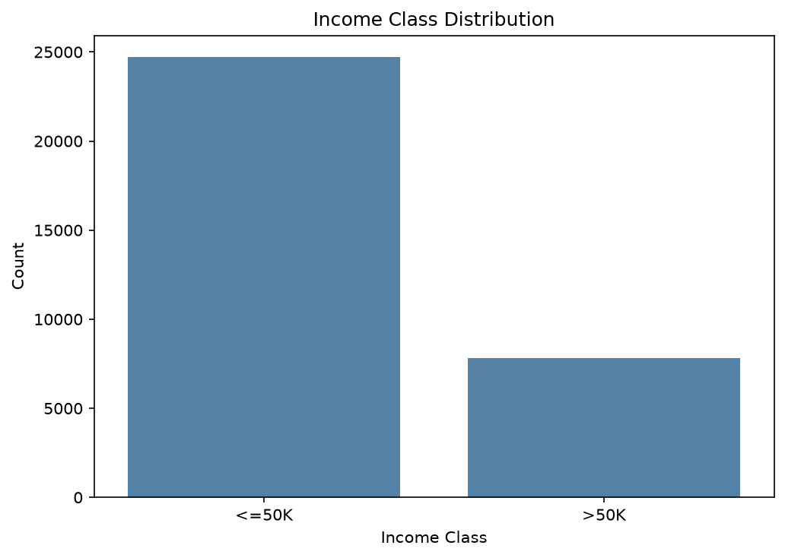
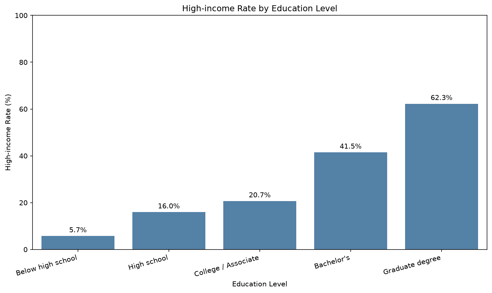
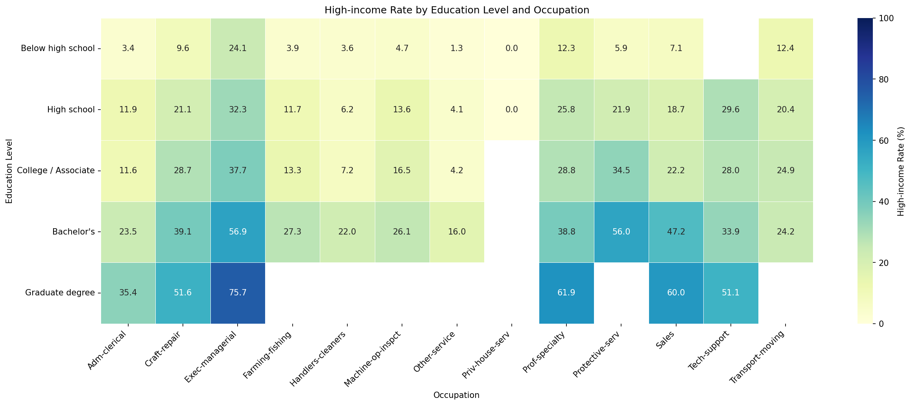
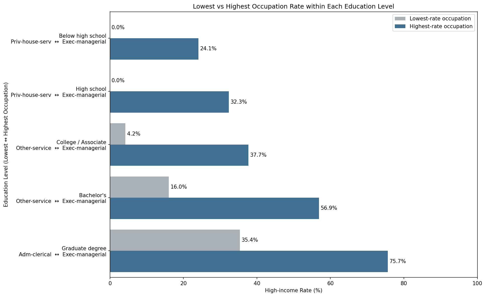
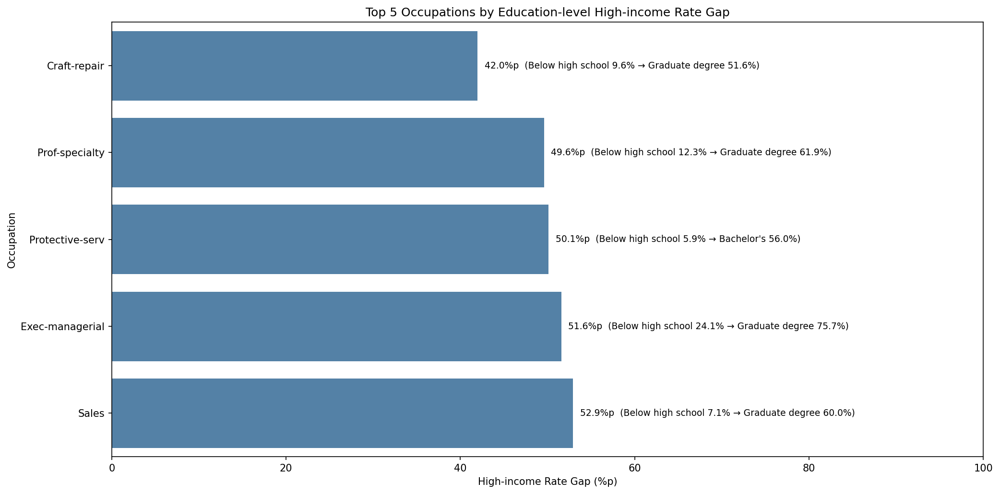
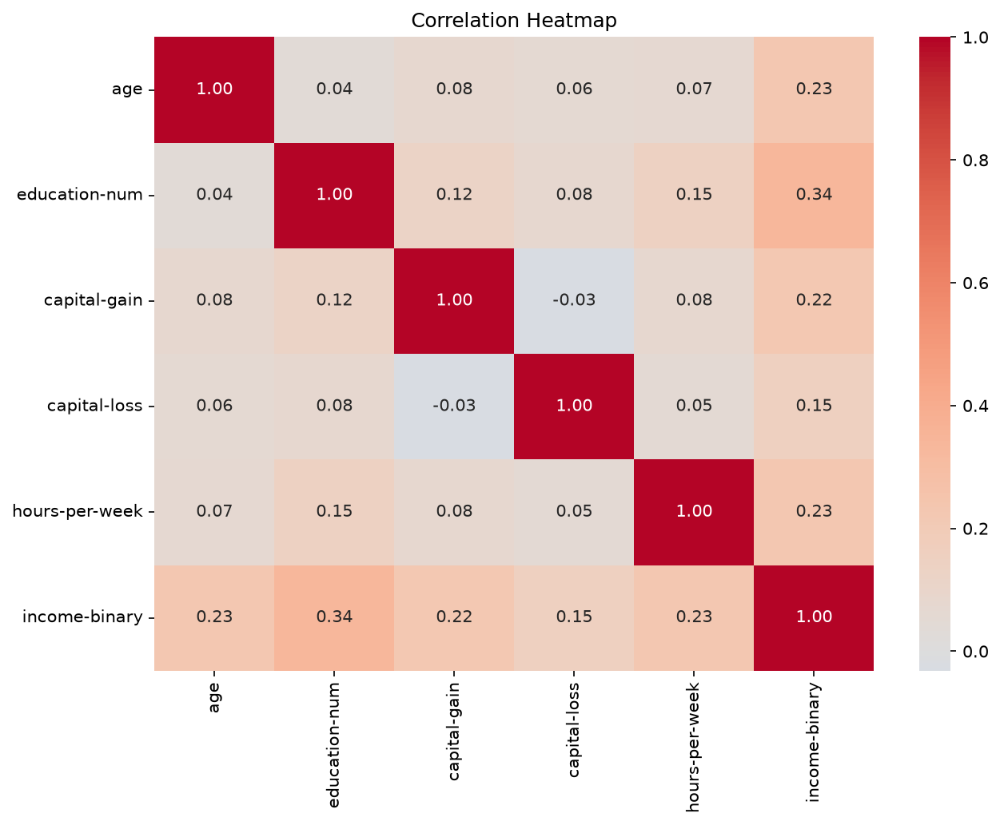
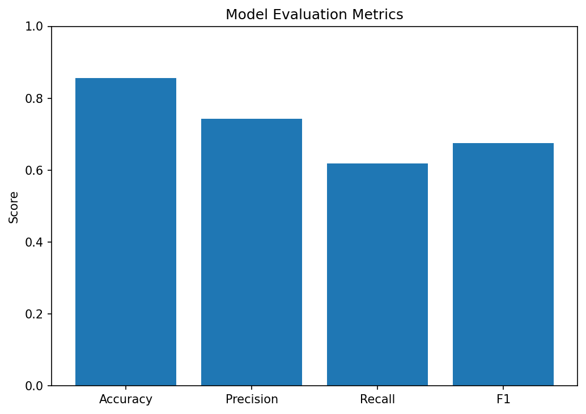
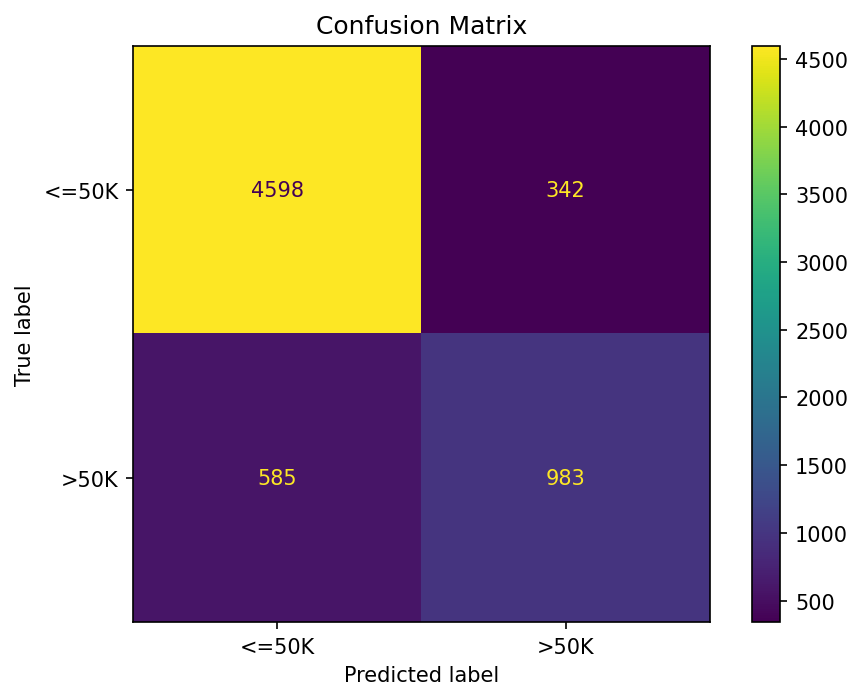

# 학력 수준과 고소득 관계 분석 보고서

## 1. 프로젝트 개요

Adult Census Income 데이터를 바탕으로 학력 수준에 따른 고소득 비율을 분석하고, 학력과 직업을 함께 고려했을 때의 차이를 시각화했습니다. 두 소득 집단의 교육 수준 차이를 검정하고, 개인 특성을 이용해 연 소득이 50K를 초과하는지 예측하는 분류 모델도 학습했습니다.

## 2. 데이터 처리 결과

| 항목 | Pandas | Polars |
|---|---:|---:|
| 정제 후 행 수 | 32537 | 32537 |
| 컬럼 수 | 15 | 15 |
| 로딩 시간(초) | 0.025171 | 0.018154 |
| 추정 메모리(Byte) | 20858690 | 3248561 |
| 제거한 중복 행 | 24 | 24 |
| 처리 전 결측치 | 4262 | 4262 |
| 처리 후 결측치 | 0 | 0 |

- Pandas와 Polars 정제 결과의 크기 일치 여부: `True`
- 전체 정제 후 행 수: 32537

원본 데이터에서 `?`로 표시된 값을 결측치로 인식했습니다. 예측 대상인 `income`이 결측된 행은 제거하고, 범주형 설명변수의 결측치는 데이터 손실을 줄이기 위해 `Unknown` 범주로 대체했습니다. 머신러닝 Pipeline에도 수치형 중앙값 및 범주형 최빈값 대치 단계를 포함하여 새로운 데이터에 결측치가 들어오는 경우를 처리하도록 구성했습니다.

## 3. 소득 분포

- <=50K: 24698명
- >50K: 7839명

## 4. 학력 수준별 고소득 비율

| 학력 그룹 | 표본 수 | 고소득 비율 |
|---|---:|---:|
| 고졸 미만 | 4248 | 5.74% |
| 고졸 | 10494 | 15.95% |
| 대학 과정·전문학사 | 9731 | 20.68% |
| 학사 | 5353 | 41.49% |
| 대학원 이상 | 2711 | 62.26% |

## 5. 학력과 직업별 고소득 비율

표본이 30명 이상인 학력·직업 조합만 히트맵에 표시했습니다.

### 5.1 같은 학력에서도 직업별 고소득 비율이 다른가?

| 학력 그룹 | 고소득률이 낮은 직업 | 비율 | 고소득률이 높은 직업 | 비율 | 격차 |
|---|---|---:|---|---:|---:|
| 고졸 미만 | Priv-house-serv | 0.0% | Exec-managerial | 24.07% | 24.07%p |
| 고졸 | Priv-house-serv | 0.0% | Exec-managerial | 32.34% | 32.34%p |
| 대학 과정·전문학사 | Other-service | 4.22% | Exec-managerial | 37.68% | 33.46%p |
| 학사 | Other-service | 16.02% | Exec-managerial | 56.9% | 40.88%p |
| 대학원 이상 | Adm-clerical | 35.37% | Exec-managerial | 75.66% | 40.29%p |

모든 학력 그룹에서 직업별 고소득률 차이가 나타났습니다. 따라서 학력이 같더라도 직업에 따라 고소득 가능성이 다르게 관측된다고 해석할 수 있습니다.

### 5.2 학력에 따른 고소득률 격차가 가장 큰 직업

아래 표는 표본 30명 이상인 학력 그룹이 3개 이상 존재하는 직업을 대상으로, 관측된 최고·최저 학력 그룹의 고소득률 격차를 계산한 결과입니다.

| 순위 | 직업 | 낮은 비율의 학력 그룹 | 비율 | 높은 비율의 학력 그룹 | 비율 | 격차 |
|---:|---|---|---:|---|---:|---:|
| 1 | Sales | 고졸 미만 | 7.08% | 대학원 이상 | 60.0% | 52.92%p |
| 2 | Exec-managerial | 고졸 미만 | 24.07% | 대학원 이상 | 75.66% | 51.58%p |
| 3 | Protective-serv | 고졸 미만 | 5.88% | 학사 | 56.0% | 50.12%p |
| 4 | Prof-specialty | 고졸 미만 | 12.28% | 대학원 이상 | 61.88% | 49.6%p |
| 5 | Craft-repair | 고졸 미만 | 9.65% | 대학원 이상 | 51.61% | 41.96%p |

이 격차는 관찰 데이터에서 나타난 연관성으로, 학력의 인과효과를 직접 의미하지는 않습니다.

## 6. 상관관계

## 7. 독립표본 t-test

- 검정 방법: Welch independent two-sample t-test
- 분석 변수: education-num
- `<=50K` 집단 평균: 9.5961
- `>50K` 집단 평균: 11.6122
- t통계량: -64.876078
- p-value: < 1e-300
- 유의수준: 0.05

p-value가 0.05보다 작으므로 두 소득 집단의 교육 수준 평균은 통계적으로 유의한 차이가 있다고 해석합니다.

## 8. 머신러닝 Pipeline 결과

- 모델: LogisticRegression
- 학습 데이터: 26029행
- 테스트 데이터: 6508행
- 정확도: 0.85756
- 정밀도: 0.741887
- 재현율: 0.626913
- F1 점수: 0.679571
- 혼동행렬: [[4598, 342], [585, 983]]
- 저장 후 재로딩 예측 일치: `True`

## 9. 산출물

- 정제 CSV: `data/processed/adult_cleaned.csv`
- 정제 Parquet: `data/processed/adult_cleaned.parquet`
- 통계 결과: `outputs/metrics/statistics.json`
- 모델 성능: `outputs/metrics/model_metrics.json`
- 저장 모델: `outputs/models/income_pipeline.joblib`